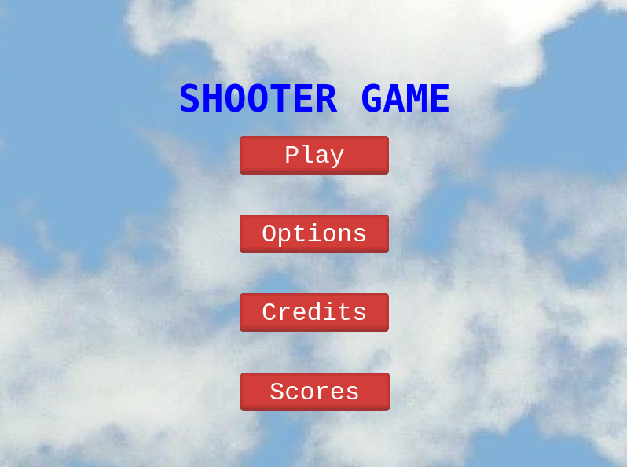

# Shooter-game

This is a game developed as a final project to complete the JavaScript Module. It is a shooter game build entirely with JavaScript and it uses Phaser 3 dependency. The score feature uses an API.

## How to play

**Use W, A, S, D keys to move and to shoot press the SPACE key.**

**Every enemy you destroy will add a point. In game over scene, you will be able to save your score with your name.**

## Built With

- JavaScript
- Webpack
- Phaser 3
- Babel
- Jest

### Linters Used

- Eslint
- Stylelint

All assets like images, sounds and music are from OpenGameArt.org.

[OpenGameArt](https://opengameart.org/)

## Live Demo - Try the game here

[Live Demo Link](https://shooter-game-jarfsoft.netlify.app/)

## Getting Started

To get a local copy follow up these simple example steps.

### Prerequisites

- Local Machine installed [Nodejs](https://nodejs.org/en/download/)
- Npm as a package manager
- A code editor as [Visual Studio](https://code.visualstudio.com/download), Sublime,etc.

### Setup

- Please make a local copy of this repo by typing this command on your terminal.

`git clone https://github.com/Jarfsoft/Shooter-game.git`

- Then, go to the folder created with:

`cd Shooter-game`

### Install

- In order to install all dependencies and assets please run this command:

`npm install`

Now that you have everything installed you need to compile everything:

`npm run build`

### Usage

Now for the usage, you just need to open the `index.html` with the live server of your choice.

You will see that your web browser open a tab and then the game is playable.

### Alternative for using the game in a local environment

After installing all the dependencies with `npm install`, you can use the server you like to load the game. In VS code you can download the extension `Live Server` by ` Ritwick Dey` and load the index.html file that is in the root of the project. The button `Go Live` will be in the lower right corner of the window.

### Run tests

To run the test implemented for the game, please run this command:

`npm run test`

## Authors

👤  **Juan Raudales**

- GitHub: [@Jarfsoft](https://github.com/Jarfsoft)
- Twitter: [@Jarfsoft](https://twitter.com/Jarfsoft)
- LinkedIn: [Juan Raudales](https://www.linkedin.com/in/juan-raudales-flores-7b0a3b113/)

## 🤝 Contributing

Contributions, issues, and feature requests are welcome!

Feel free to check the [issues page](https://github.com/Jarfsoft/Shooter-game/issues).

## Show your support

Give a ⭐️ if you like this project!

## Acknowledgments

- Thank you to opengameart.org that provided me all the assets for the game
- Thank you to Microvsere, who challenge me to built this game.

## 📝 License

This project is MIT licensed.
